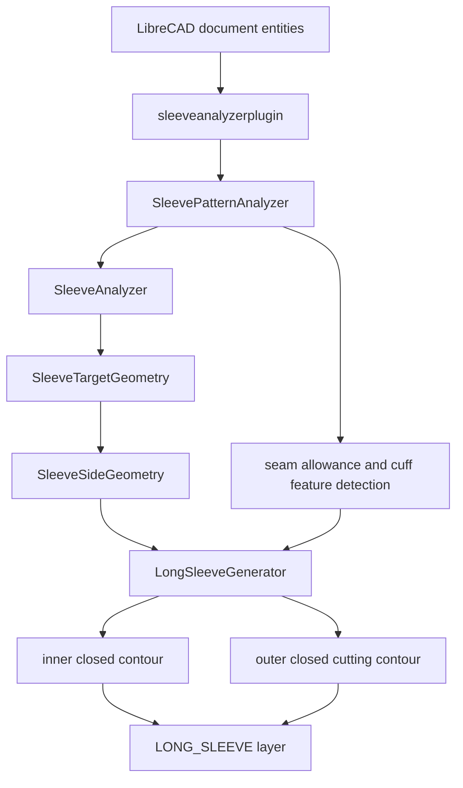

# LibreCAD Sleeve Analyzer

LibreCAD 2.2.0.2 的袖型分析與長袖生成插件。插件從目前圖面中的袖片
Polyline、縫份輪廓與輔助線自動辨識袖山、袖口、Sleeve Axis、縫份與袖口
結構，再依指定尺寸產生長袖的實際尺寸內框與外擴裁切框。

本文件說明目前程式的資料流、幾何原理、主要函數、建置、測試、部署與
常見問題。程式碼的座標計算都使用圖面原始單位；只有報告、尺寸表與
`LongSleeveContour` 的公開結果轉換為 mm。

## 目前功能定義

目前長袖生成器的輸出有兩個輪廓：

1. `vertices`：長袖實際尺寸內框。
2. `outerVertices`：以偵測到的短袖縫份外擴量建立的裁切外框。

原短袖袖山 1→2 的頂點、bulge 與弧線形狀會保留。新的長袖兩條主體側線
是直線，並由實際的袖山外框與袖口裁切線求交後決定端點。

原短袖的 cuff fold/stitch 輔助線只用於量測 A 與辨識來源資料，**不會再
複製到新長袖袖口**。這是目前的刻意行為；原圖面中的短袖實體也不會被
刪除或修改。



## 使用前提

- LibreCAD 2.2.0.2。
- Windows 32-bit Qt/MinGW 執行環境與 LibreCAD ABI 相容。
- 圖面中的袖片需能被分析器辨識為閉合 Polyline；目前插件入口透過
  `pathFromEntity()` 讀取 `DPI::POLYLINE`、`DPI::LINE`、`DPI::POINT`、
  `DPI::TEXT` 與 `DPI::MTEXT`。
- 圖面 `$INSUNITS` 為 `1` 時視為 inch，為 `4` 時視為 mm；其他值會標記
  為 Unknown，需由呼叫端確認圖面單位。
- 尺寸表位於插件旁的 `sleeve_sizes.json`。

## 幾何座標約定

`SleeveAnalyzer` 建立以下局部座標：

- `point1`、`point2`：袖山 1、2 的端點。
- `point3`：袖軸與袖山基準的交點。
- `cuffCenter`：原袖口裁切線的中心。
- `sleeveAxis`：由袖山 `point3` 指向原袖口 `cuffCenter` 的單位向量。
- `cuffUpper`、`cuffLower`：原袖口線兩端。
- `cuffDirection`：由 `cuffUpper` 指向 `cuffLower` 的單位向量。

軸向投影定義為：

```text
axial(P) = dot(P - cuffCenter, sleeveAxis)
```

因此原袖口裁切線的中心投影接近 0。袖口特徵線只用來找出原始折車線
相對於這條裁切線的位置，不再直接輸出到長袖。

## 幾何演算法

### 1. 原始袖山辨識

`SleeveAnalyzer::analyze()` 先將 bulge segment 取樣成點列，計算各邊長、
弧線長度、弦長與偏差。它選出最符合袖山特徵的曲線與最符合袖口特徵的
近似直線，再由袖口中心朝袖山基準作無限線求交，得到 `point3`。

原始袖山方向與端點排序會根據幾何位置決定，不依賴圖面一定朝向 X 或 Y
軸，因此旋轉後的袖片仍可分析。

### 2. 短袖輔助圖形辨識

`SleevePatternAnalyzer::analyze()` 將與袖片接近的圖元分類為：

- `SeamAllowance`：包住袖片且距離接近預設縫份的閉合輪廓。
- `CuffFold`：與袖口方向平行、且位於袖口附近的第一條特徵線。
- `CuffStitch`：下一條平行的袖口特徵線。
- `Marking`：其餘關聯但非袖口結構的線。

縫份預設值是 `7.9375 mm = 0.3125 in`，但只在無法偵測來源縫份時作為
fallback。一般情況下使用圖面實測值。

### 3. 目標袖口與直線側線

`SleeveTargetGeometry::calculate()` 將尺寸表中的袖長與袖口寬度轉為圖面
單位：

```text
target.center = point3 + sleeveAxis * targetSleeveLength
target.upper  = target.center + transverse * targetCuffWidth / 2
target.lower  = target.center - transverse * targetCuffWidth / 2
```

`SleeveSideGeometry::calculate()` 保留原袖山端點的起始方向驗證，但長袖
側線本身只建立兩個點：

```text
P1 -> target.upper
P2 -> target.lower
```

不插入中間曲線點，也不改動袖山曲線。

### 4. 實際尺寸內框

`buildContourInternal()` 找出輸入閉合 Polyline 中的 1→2 袖山段，逐一複製
原始袖山頂點與 bulge。袖山終點的 outgoing bulge 會設為 0，因為該 bulge
屬於原短袖側線；新長袖從該端點開始必須是直線。

接著依袖山方向把兩條長袖側線與目標袖口串成閉合內框，並使用
`SleeveGeometry::isSimpleClosedPolyline()` 檢查：

- 尺寸與袖山長度沒有改變。
- 不存在非相鄰線段交叉。
- 不存在重複點造成的零長度段。
- 閉合段也通過交叉檢查。

### 5. 動態量測 A

A 不寫死，也不從縫份外框誤算。現行流程是：

1. `sourceCuffCutAxial()` 使用 `SleeveAnalysis::sampledCuff`，量測原始
   袖口裁切線相對於 `cuffCenter` 的袖軸投影。
2. `innerCuffFeatureAxial()` 從來源 cuff fold/stitch 線找出最靠袖山側的
   內側折車線投影。
3. 計算：

```text
A = abs(innerCuffFeatureAxial - sourceCuffCutAxial)
```

4. `originalCuffCutToFoldDistanceMM` 與 `cuffInsetMM` 儲存 A 的 mm 值。

這樣可以避免把 `0.75 in` 的原始折車寬度與縫份外框投影重複相加。在目前
fixture 中，A 由原始幾何量測為 `19.05 mm = 0.75 in`，不是程式內固定的
常數。

### 6. 外擴裁切框與實際求交

`buildExpandedOuter()` 是外框的核心函數：

1. `contourOutwardNormal()` 依內框 winding 計算每條側線的外法向量。
2. 兩條長袖側線各自沿外法線 offset 實測縫份量，預設為 0.3125in。
3. 袖山外擴輪廓優先使用來源 `pattern.seamAllowance.vertices`，保留來源
   袖山外擴的實際形狀；若來源路徑不適合，才用 `outwardOffset()` 以
   `QPainterPathStroker` 建立幾何 fallback。
4. `linePolylineIntersection()` 將 offset 側線視為無限延長線，與袖山
   外擴折線實際求交；交點就是靠袖山端的最終接合點。
5. 若交點落在取樣折線端點的切線延長上，使用切線 fallback，再由
   `polylineSegmentAtPoint()` 和 `clipCapRoute()` trim 掉多餘段，避免回折
   或重疊。
6. 另一端將兩條 offset 側線與外擴袖口裁切線作無限直線求交；交點就是
   最終外框的袖口端點，不使用固定 target cuff endpoint。
7. 最後用 `isSimpleClosedPolyline()` 驗證 outer contour。

外擴袖口裁切線沿 `sleeveAxis` 使用動態 A 定位。因為現行 Axis 定義是
「袖山 → 袖口」，外擴裁切線使用 `+A` 方向；這避免把袖口推回袖山側而
造成長袖縮短。

### 7. 不複製原袖口輔助線

`SleevePatternAnalyzer` 仍然會辨識 cuff fold/stitch，因為它們是量測 A
與報告來源結構所需的資料；但 `LongSleeveGenerator` 不再將
`pattern.cuffFeatures` 轉換成 `LongSleeveFeature` 並輸出到新長袖袖口。

`LongSleeveContour::generatedFeatures` 欄位保留是為了維持既有資料結構與
呼叫端相容，目前刻意保持空集合。`generate(pattern)` 只輸出：

1. `outerVertices` 外擴裁切框。
2. `vertices` 實際尺寸內框。

原短袖圖形不會由插件刪除或改寫。

## 主要函數說明

### `SleeveAnalyzer`

| 函數 | 用途 |
|---|---|
| `analyze()` | 從閉合袖片辨識袖山、袖口、P1/P2/P3 與 Sleeve Axis。 |
| `mmToDrawingUnit()` | 將 mm 轉成 inch 或 mm 圖面單位。 |
| `drawingUnitToMM()` | 將圖面單位轉成 mm。 |
| `deterministicTransverse()` | 根據 Axis 建立穩定的橫向方向。 |
| `sampleBulgedSegment()` | 將 bulge segment 取樣為圓弧點列。 |
| `isSimpleClosedPolyline()` | 檢查閉合折線的重複點與自交。 |

### `SleevePatternAnalyzer`

| 函數 | 用途 |
|---|---|
| `defaultSeamAllowanceMM()` | 回傳 7.9375mm 的 fallback 縫份。 |
| `analyze()` | 關聯袖片、縫份、袖口特徵與 marking lines。 |
| `analyzeDocument()` | 從整份文件自動選擇候選袖片與來源縫份。 |
| `isAssociated()` | 依 bounding box 與路徑距離判斷圖元是否相關。 |
| `boundaryDistance()` | 計算兩個輪廓邊界的代表距離。 |
| `closedArea()` | 供候選袖片排序的封閉面積。 |

### `SleeveTargetGeometry` 與 `SleeveSideGeometry`

| 函數 | 用途 |
|---|---|
| `SleeveTargetGeometry::calculate()` | 依尺寸表建立目標袖口中心與上下端點。 |
| `SleeveSideGeometry::calculate()` | 建立 P1/P2 到目標袖口的兩條直線側線。 |
| `startTangent()` | 找出原袖山端點的側線方向，僅用於驗證與方向判定。 |
| `buildSide()` | 產生兩點直線，不再產生曲線中間點。 |

### `LongSleeveGenerator`

| 函數／helper | 用途 |
|---|---|
| `buildContour()` | 建立不含 pattern 或含 pattern 的長袖幾何結果。 |
| `generate()` | 將 contour 寫入 LibreCAD 的 `LONG_SLEEVE` layer。 |
| `buildContourInternal()` | 整合袖山保留、側線、A 量測、外框與驗證。 |
| `sourceCuffCutAxial()` | 從原始袖口裁切線取樣量測 axial 基準。 |
| `innerCuffFeatureAxial()` | 找來源內側折車線的袖軸投影。 |
| `outwardOffset()` | 使用 Qt path stroker 建立外擴輪廓 fallback。 |
| `contourOutwardNormal()` | 依 polygon winding 找每條側線的外法向。 |
| `lineLineIntersection()` | 求兩條無限直線交點。 |
| `linePolylineIntersection()` | 求無限側線與有限袖山折線的實際交點。 |
| `clipCapRoute()` | 以兩個交點裁切袖山外擴路徑。 |
| `polylineSegmentAtPoint()` | 判斷切線 fallback 交點落在哪一段。 |
| `addPolylineGroupCompat()` | 新版 host 使用單一 undo group；舊 host fallback 到逐條 `addPolyline()`。 |

## 檔案結構

```text
plugins/sleeveanalyzer/
├── LongSleeveGenerator.cpp/.h       長袖內框、外框與生成流程
├── SleeveAnalyzer.cpp/.h             P1/P2/P3、袖山、袖口與 Axis
├── SleeveGeometry.cpp/.h             向量、交點、取樣、自交檢查
├── SleevePatternFeatures.cpp/.h      縫份與袖口輔助線辨識
├── SleeveTargetGeometry.cpp/.h       目標尺寸與目標袖口
├── SleeveSideGeometry.cpp/.h         兩條長袖直線側線
├── SleeveDebugDialog.cpp/.h          預覽、報告與生成按鈕
├── SleeveSizeTable.cpp/.h            JSON 尺寸表讀取
├── sleeveanalyzerplugin.cpp/.h       LibreCAD plugin entry point
├── sleeveanalyzer.pro                qmake plugin project
├── sleeve_sizes.json                 尺寸表
├── build-plugin.ps1                  Windows 獨立建置／部署腳本
├── tests/
│   ├── SleeveAnalyzerTests.cpp      幾何與回歸測試
│   ├── PluginLoadTest.cpp            DLL 載入測試
│   ├── tests.pro                    qmake 測試設定
│   └── run-tests.ps1                測試建置與執行腳本
└── README.md                         本文件
```

另外，LibreCAD host 端有以下整合變更：

- `librecad/src/plugins/document_interface.h`
  新增 `Document_Interface_Extension`，不改動既有 `Document_Interface`
  virtual table。
- `librecad/src/main/doc_plugin_interface.h/.cpp`
  實作 `addPolylineGroup()`，把外框與內框放在一個 undo section。
- `plugins/plugins.pro`
  將 `sleeveanalyzer` 加入 plugin subdirs。

## Windows 編譯環境

目前腳本預設使用：

```text
Qt SDK:     H:\librecad\QtOss\5.12.5\mingw73_32
MinGW:      H:\librecad\Qt\Tools\mingw730_32\bin
Qt runtime: C:\Program Files (x86)\LibreCAD
```

腳本使用 Qt 5、MinGW 7.3、C++11、32-bit plugin ABI。若工具安裝在其他
位置，可用 `-QtSdk` 與 `-CompilerRoot` 覆蓋。

## 編譯插件

在 repository 的 `plugins/sleeveanalyzer` 目錄執行：

```powershell
cd H:\librecad\LibreCAD-2.2.0.2\plugins\sleeveanalyzer
powershell -ExecutionPolicy Bypass -File .\build-plugin.ps1
```

腳本會依序：

1. 檢查 `g++.exe`、`moc.exe` 與 Qt headers。
2. 產生 `moc_sleeveanalyzerplugin.cpp`。
3. 以 `-std=c++11 -O2 -Wall -Wextra` 編譯所有插件 source。
4. 連結 Qt Widgets、Qt Gui、Qt Core 與 MinGW runtime。
5. 輸出：

```text
windows/resources/plugins/sleeveanalyzer1.dll
windows/resources/plugins/sleeve_sizes.json
```

自訂工具路徑：

```powershell
powershell -ExecutionPolicy Bypass -File .\build-plugin.ps1 `
  -QtSdk 'D:\Qt\5.12.5\mingw73_32' `
  -CompilerRoot 'D:\Qt\Tools\mingw730_32\bin'
```

## 執行測試

使用專案附帶的 fixture：

```powershell
cd H:\librecad\LibreCAD-2.2.0.2\plugins\sleeveanalyzer\tests
powershell -ExecutionPolicy Bypass -File .\run-tests.ps1 `
  -Fixture 'H:\librecad\M-Q0419A-袖X2.dxf'
```

測試包含：

- DXF fixture 中袖片候選辨識。
- P1/P2/P3 與袖山 segment 數量。
- 旋轉後的方向與目標袖口幾何。
- 兩條側線確實為直線且 endpoint 正確。
- 原袖山頂點與 bulge 保留。
- 動態縫份量測。
- 原袖口裁切線到內側折車線的 A 量測。
- 外擴袖口方向為 `+A`。
- 外框與內框 closed、simple、無自交。
- `generatedFeatures` 為空，確認來源 cuff fold/stitch 沒有複製到新袖口。
- DLL plugin load test。

成功輸出應包含：

```text
SleeveAnalyzer tests passed.
Sleeve Analyzer loaded successfully.
```

## 部署插件

建置並部署到目前使用者的 LibreCAD plugin 目錄：

```powershell
cd H:\librecad\LibreCAD-2.2.0.2\plugins\sleeveanalyzer
powershell -ExecutionPolicy Bypass -File .\build-plugin.ps1 -Deploy
```

部署位置：

```text
C:\Users\<user>\Documents\LibreCAD\plugins\sleeveanalyzer1.dll
C:\Users\<user>\Documents\LibreCAD\plugins\sleeve_sizes.json
```

若 LibreCAD 正在執行，Windows 可能鎖定 DLL，導致 `Copy-Item` 失敗。此時：

1. 關閉所有 LibreCAD 視窗。
2. 確認工作管理員沒有 `LibreCAD.exe`。
3. 重新執行 `build-plugin.ps1 -Deploy`。
4. 重新啟動 LibreCAD。

插件入口會從 DLL 自身路徑尋找 `sleeve_sizes.json`，因此 DLL 與 JSON 必須
放在同一個 plugins 目錄。

## 在 LibreCAD 中使用

1. 開啟含袖片 Polyline 的 DXF。
2. 確認圖面 `$INSUNITS` 正確。
3. 從 `Plugins > Sleeve Analyzer` 開啟插件。
4. 插件掃描目前文件，選出袖片、縫份與袖口輔助線。
5. 在 Debug dialog 選擇尺寸與 variant。
6. 確認報告中的 P1、P2、P3、Sleeve Axis、縫份與 A 相關幾何。
7. 按 Generate Long Sleeve。
8. 生成的 polyline 會放到 `LONG_SLEEVE` layer，原短袖資料保留。

若要重新生成，建議先在圖面中刪除上一次生成的 `LONG_SLEEVE` layer 內容，
避免重複疊加；插件不會自動刪除使用者既有實體。

## ABI 與 undo 相容性

LibreCAD 已安裝版本可能仍使用舊的 `Document_Interface` vtable。為避免
直接新增 virtual 導致既有插件 ABI 位移，程式使用獨立的
`Document_Interface_Extension`：

```cpp
Document_Interface_Extension* extension =
    dynamic_cast<Document_Interface_Extension*>(document);
```

- 新版 `Doc_plugin_interface` 支援 extension 時，外框與內框放在同一個
  undo operation。
- 舊 host 不支援時，安全退回原有逐條 `addPolyline()`。
- 因此不直接修改原始 `Document_Interface` 的 virtual method 順序。

## GitHub 發佈建議

本工作樹目前是 LibreCAD `2.2.0.2` 的 detached HEAD，`origin` 指向：

```text
https://github.com/LibreCAD/LibreCAD.git
```

不要直接對該 `origin` push。要發佈到自己的 GitHub repository，先建立
自己的空 repository，然後在本地執行：

```powershell
cd H:\librecad\LibreCAD-2.2.0.2
git switch -c feature/sleeve-analyzer
git remote add github https://github.com/<owner>/<repository>.git
git add plugins/sleeveanalyzer `
        librecad/src/main/doc_plugin_interface.cpp `
        librecad/src/main/doc_plugin_interface.h `
        librecad/src/plugins/document_interface.h `
        plugins/plugins.pro
git commit -m "Add sleeve analyzer and long sleeve generator"
git push -u github feature/sleeve-analyzer
```

如果 repository 不是從 LibreCAD 上游 fork，而是要只放插件，應另外建立
獨立 repository，將 `plugins/sleeveanalyzer` 作為 repository root；此時
需要同步調整 `build-plugin.ps1` 中的 `repositoryRoot` 與 LibreCAD headers
路徑，或保留完整 LibreCAD source tree。

## 常見問題

### 找不到 Qt 或 MinGW

確認 `-QtSdk` 指向包含 `bin\moc.exe`、`include\QtCore` 與 `lib` 的 Qt SDK，
以及 `-CompilerRoot` 內有 `g++.exe`。

### 插件能建置但 LibreCAD 不載入

- 確認 Qt/MinGW 位元數與 LibreCAD 相同。
- 確認 DLL 放在 `Documents\LibreCAD\plugins`。
- 確認 `sleeve_sizes.json` 與 DLL 同目錄。
- 關閉舊版 LibreCAD 後重新部署，避免 DLL 被鎖定。
- 執行 `PluginLoadTest.exe` 確認基本載入。

### 生成外框失敗

先查看 Debug dialog 的分析報告：

- P1/P2 必須存在於原始 Polyline。
- 目標袖長必須大於原袖長。
- 目標袖口寬度必須大於 0。
- 原袖山外擴輪廓必須能與 offset 側線形成有效路徑。
- 結果若自交或有零長度段，生成器會拒絕寫入圖面。

### 為什麼看不到原短袖 fold/stitch 線被刪除？

插件不會刪除或修改原始短袖。它只是不再把來源輔助線複製到新長袖；
若要隱藏原短袖，請在 LibreCAD 中關閉或另行處理原圖層。

## 版本驗證紀錄

目前驗證流程：

```text
SleeveAnalyzer regression tests: passed
Plugin load test: passed
Plugin build: -Wall -Wextra passed
Deployment: build-plugin.ps1 -Deploy
```

fixture 測試中的重要幾何條件包括：

- Sleeve cap segment count：54。
- Fixture seam allowance：7.9375 mm。
- Fixture cuff fold width：19.05 mm。
- Fixture cuff cut-to-inner-fold A：19.05 mm。
- Fixture outer contour：closed、simple、無自交。
